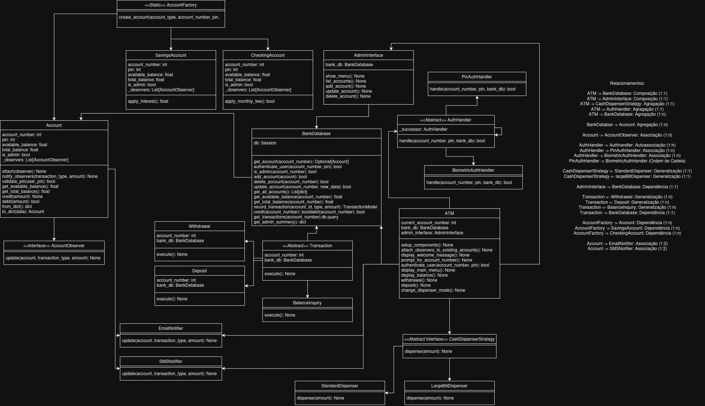
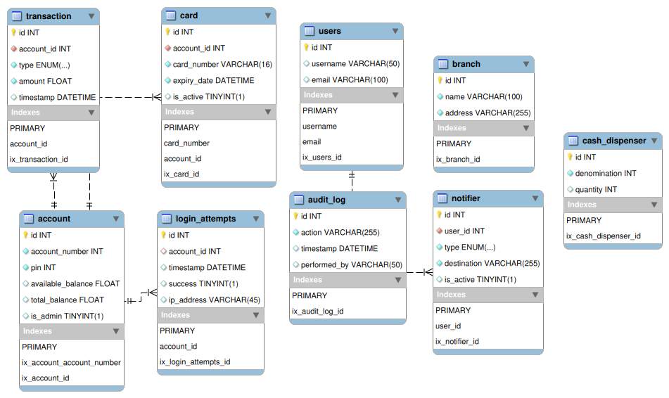

# Projeto Final de TPPE
Aluno: Artur henrique Holz Bartz - 221007869 
Professor: Thiago Luiz 
Turma: Noturno 

Link do repositório antigo (Orientação a Objetos): https://github.com/H0lzz/ATM2023.1 

O projeto se trata em uma máquina ATM (projeto de Orientação a Objetos) implementada com as técnicas e tecnologias emergentes aboraddas em sala de aula na disciplina de TPPE. 

# Arquitetura
A arquitetura escolhida foi a arquitetura limpa (Clean Archtecture) que garante: 
Separação de responsabilidades 
Baixo acoplamento 
Facilidade de testes 
Escalabilidade e manutenibilidade 

# Diagrama UML

Relacionamentos:

ATM -> BankDatabase: Composição (1:1) 
ATM -> AdminInterface: Composição (1:1) 
ATM -> CashDispenserStrategy: Agragação (1:1) 
ATM -> AuthHandler: Agragação (1:1) 
ATM -> BankDatabase: Agregação (1:n) 

BankDatabse -> Account: Agregação (1:n) 

Account -> AccountObserver: Associação (1:n) 

AuthHandler -> Authhandler: Autoassociação (1:n) 
AuthHandler -> PinAuthHandler: Associação (1:n) 
AuthHandler -> BiometricAuthHendler: Associação (1:n) 
PinAuthHandler -> BiometricAuthHandler (Ordem de Cadeia) 

CashDispenserStrategy <- StandardDispenser: Generalização (1:1) 
CashDispenserStrategy <- largeBillDispenser: Generalização (1:1) 

AdminInterface -> BankDatabase: Dependência (1:1) 

Transaction <- Withdrawal: Generalização (1:n) 
Transaction <- Deposit: Generalização (1:n) 
Transaction <- BalanceInquiry: Generalização (1:n) 
Transaction -> BankDatabase: Dependência (1:1) 

AccountFactory -> Account: Dependência (1:n) 
AccountFactory -> SavingsAccount: Dependência (1:n) 
AccountFactory -> CheckingAccount: Dependência (1:n) 

Account -> EmailNotifier: Associação (1:2) 
Account -> SMSNotifier: Associação (1:2) 

# Modelo Físico do Banco de Dados

# Backlog - Histórias de Usuário (User Story)

Arquivo de backlog: [Backlog](docs/UserStories.md) 
Link Trello: (https://trello.com/invite/b/6816187b0f978e40a257edb1/ATTI5879d2caa32b99bec8bfee3eb1da2d5bF3B54DB1/backlog-tppe) 
Protótipo de alta fidelidade (Figma): https://www.figma.com/proto/7igZPLpx9gD3tHRqC0nXxF/ATM2025.1?node-id=7501-175&starting-point-node-id=7501%3A175&t=7HSQscz8ki573vfO-1  
